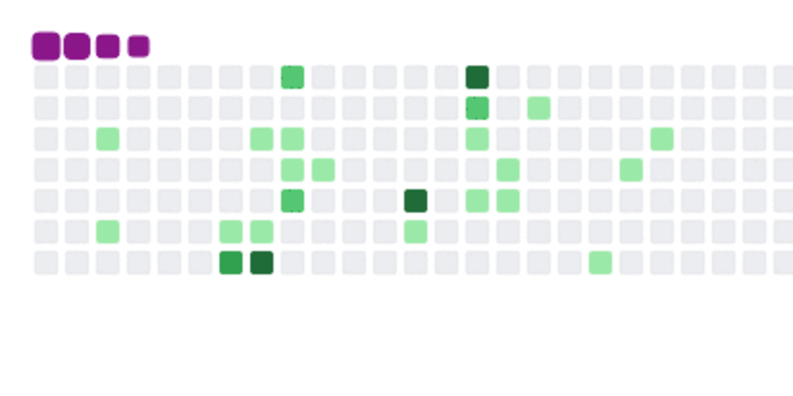

<h1>
👋 Hi, I’m @kalendola, Front-end, Back-end Javascript.
</h1>
<table align="center">

 <tr>
   <td>
       
   </td> 
   <td>
     
   </td>
    <td>
      
   </td>
   <td>
     
   </td>
 
  </tr>-
  </table>

👋 Hi, I’m @kalendola
- 👀 I’m interested in designer and front-end development
- 🌱 I'm currently learning SQL improving javascript.
- 💞️ I'm looking to collaborate with companies on front-end development.

